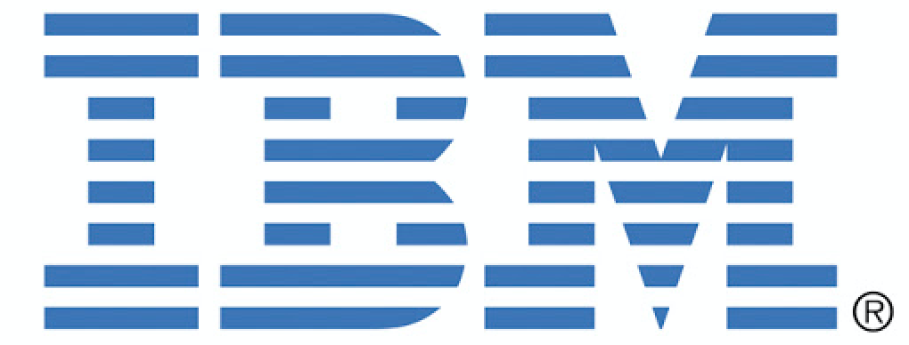
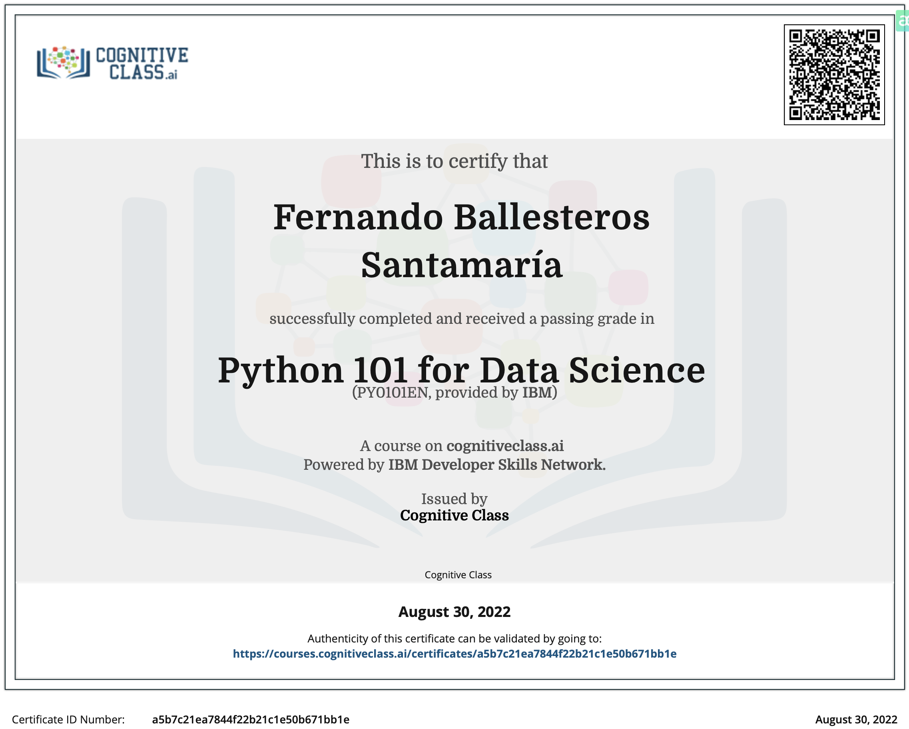
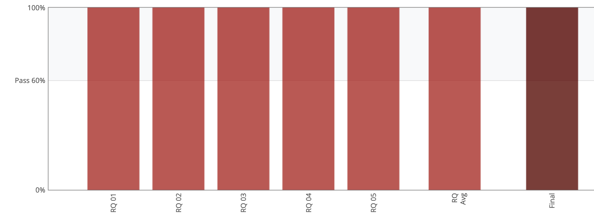

# IBM Developer Skills Network
## Python for Data Science - PY0101EN

### 

### If you are interested in this course, it is avalable [here](https://cognitiveclass.ai/courses/python-for-data-science).

### CERTIFICATION:

### A Few Things To Know About This Course

#### - This course is self-paced. There is no instructor to follow or to rush you along - you learn on your own schedule. This also means you are going to need to be disciplined in your studies.

#### - You can start it at any time and you can take as long as you need to complete it. Your place in the course will be remembered and your labs will be saved. However, we strongly recommend that you don't take prolonged breaks between lessons as the mind tends to forget what it does not practice.

#### - You can review the course as many times as you wish, even after completing it.

#### - This is a hands-on course where you will gain practical skill by doing hands-on labs. We provide a a complete virtual lab environment on the cloud that you can access from anywhere as long as you have internet connection.

### PREREQUISITES:

#### - Familiarity with Jupyter Notebooks

### RECOMMENDED SKILLS PRIOR TO TAKING THIS COURSE:

#### - Some Python programming experience

#### All the exercises of the course are doing in their own Jupyter-based lab environment. So in the exercises folder you only find one that I prefer to solve it out of Jupyter lab because the use and creation of files on Jupyter have a bug so I must work on it offline and upload the solution.

### GRADED:
#### Here is the percentages notes of each module, the final exam. and the final grade percentage.

